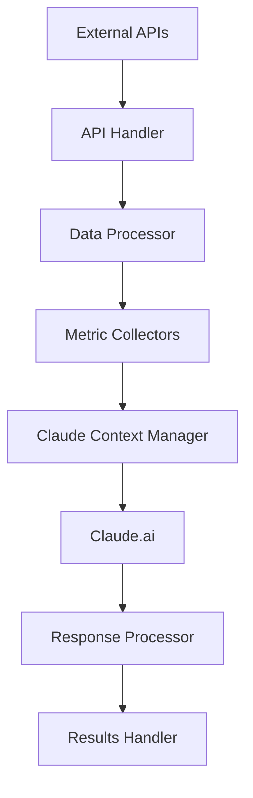

# Phase 2.3: Integration Points Analysis

## 1. System Integration Architecture

### 1.1 Current Data Flow



### 1.2 Integration Issues Identified

1. Data Transformation Points:
   - No standardized data format between components
   - Missing validation at boundaries
   - Inefficient data copying
   - No streaming support

2. Error Handling:
   - Inconsistent error propagation
   - Missing retry mechanisms
   - No fallback strategies
   - Incomplete error context

3. Performance:
   - Sequential processing bottlenecks
   - Memory inefficient transformations
   - Missing caching layers
   - No request batching

## 2. Enhanced Integration Architecture

### 2.1 Data Flow Manager

```python
class DataFlowManager:
    def __init__(self, config: Config):
        self.config = config
        self.transformers = self._init_transformers()
        self.validators = self._init_validators()
        self.cache = CacheManager()
        self.metrics = MetricsCollector()

    async def process_data_flow(self, data: Dict[str, Any]) -> Dict[str, Any]:
        """Manage data flow through the system"""
        async with self.metrics.measure('data_flow'):
            # 1. Input Validation
            validated_data = await self._validate_input(data)

            # 2. Transform for Processing
            processing_data = await self._transform_for_processing(validated_data)

            # 3. Process with Claude
            claude_response = await self._process_with_claude(processing_data)

            # 4. Transform Response
            final_result = await self._transform_response(claude_response)

            return final_result

    async def _validate_input(self, data: Dict[str, Any]) -> Dict[str, Any]:
        """Validate input data at system boundary"""
        for validator in self.validators:
            data = await validator.validate(data)
        return data

    async def _transform_for_processing(self, data: Dict[str, Any]) -> Dict[str, Any]:
        """Transform data for processing"""
        processed_data = data
        for transformer in self.transformers:
            processed_data = await transformer.transform(processed_data)
        return processed_data
```

### 2.2 Claude Integration Manager

```python
class ClaudeIntegrationManager:
    def __init__(self, config: Config):
        self.config = config
        self.client = self._init_claude_client()
        self.context_manager = ContextManager()
        self.prompt_manager = PromptManager()
        self.response_processor = ResponseProcessor()
        self.metrics = MetricsCollector()

    async def process_request(self, data: Dict[str, Any]) -> Dict[str, Any]:
        """Process a request through Claude.ai"""
        try:
            # 1. Prepare Context
            context = await self.context_manager.prepare(data)

            # 2. Generate Prompt
            prompt = await self.prompt_manager.generate(context)

            # 3. Process with Claude
            response = await self._call_claude(prompt)

            # 4. Process Response
            processed_response = await self.response_processor.process(response)

            return processed_response

        except Exception as e:
            await self._handle_error(e)
            raise

    async def _call_claude(self, prompt: str) -> Dict[str, Any]:
        """Make the actual call to Claude.ai"""
        async with self.metrics.measure('claude_api_call'):
            try:
                response = await self.client.messages.create(
                    model=self.config.CLAUDE_MODEL,
                    max_tokens=self.config.MAX_TOKENS,
                    messages=[
                        {
                            "role": "user",
                            "content": prompt
                        }
                    ]
                )
                return response

            except Exception as e:
                self.metrics.increment('claude_errors')
                raise ClaudeProcessingError(f'Claude API error: {str(e)}')
```

### 2.3 Context Management

```python
class ContextManager:
    def __init__(self):
        self.token_counter = TokenCounter()
        self.context_optimizer = ContextOptimizer()
        self.templates = self._load_templates()

    async def prepare(self, data: Dict[str, Any]) -> Dict[str, Any]:
        """Prepare context for Claude processing"""
        # 1. Extract relevant data
        context = self._extract_context(data)

        # 2. Check token count
        token_count = await self.token_counter.count(context)

        # 3. Optimize if needed
        if token_count > self.MAX_TOKENS:
            context = await self.context_optimizer.optimize(context)

        # 4. Add metadata
        context['metadata'] = self._add_metadata(context)

        return context

    def _extract_context(self, data: Dict[str, Any]) -> Dict[str, Any]:
        """Extract relevant data for context"""
        context = {
            'metrics': {
                'market': data.get('market_metrics'),
                'volume': data.get('volume_metrics'),
                'social': data.get('social_metrics'),
                'development': data.get('dev_metrics')
            },
            'analysis_type': data.get('analysis_type', 'general'),
            'timeframe': data.get('timeframe', '24h')
        }

        return context
```

## 3. Error Handling Strategy

### 3.1 Error Propagation

```python
class ErrorManager:
    def __init__(self):
        self.error_handlers = self._init_error_handlers()
        self.metrics = MetricsCollector()

    async def handle_error(self, error: Exception, context: Dict[str, Any]) -> None:
        """Handle errors with context"""
        error_type = type(error).__name__
        self.metrics.increment(f'errors.{error_type}')

        handler = self.error_handlers.get(error_type, self._default_handler)
        await handler(error, context)

    async def _handle_claude_error(self, error: ClaudeError, context: Dict[str, Any]) -> None:
        """Handle Claude-specific errors"""
        if isinstance(error, TokenLimitError):
            # Attempt to optimize context and retry
            optimized_context = await self.context_optimizer.optimize(context)
            return await self._retry_with_optimized_context(optimized_context)

        if isinstance(error, TimeoutError):
            # Implement retry with backoff
            return await self._retry_with_backoff(context)
```

## 4. Performance Optimization Points

### 4.1 Caching Strategy
```python
class CacheManager:
    def __init__(self, config: Config):
        self.redis_client = self._init_redis(config)
        self.local_cache = TTLCache(maxsize=1000, ttl=300)
        self.metrics = MetricsCollector()

    async def get(self, key: str) -> Optional[Dict[str, Any]]:
        """Get data from cache with fallback"""
        # Try local cache first
        if data := self.local_cache.get(key):
            self.metrics.increment('cache.local.hit')
            return data

        # Try Redis cache
        if data := await self.redis_client.get(key):
            self.metrics.increment('cache.redis.hit')
            self.local_cache[key] = data
            return data

        self.metrics.increment('cache.miss')
        return None
```

## 5. Recommendations

### 5.1 Immediate Improvements
1. Implement standardized data formats
2. Add boundary validations
3. Implement comprehensive error handling
4. Add caching layer
5. Optimize context management

### 5.2 Long-term Improvements
1. Add streaming support
2. Implement distributed processing
3. Add advanced caching strategies
4. Implement predictive optimization
5. Add real-time monitoring

Would you like me to proceed with implementing any of these components or move on to the next phase?